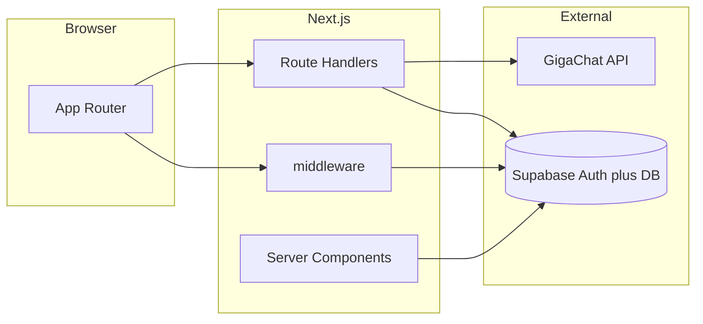

# Lingua-Bloom

Платформа для языкового обучения: идеи и материалы превращаются в интерактивные тесты с помощью ИИ (GigaChat) и хранятся в Supabase.

## Функциональность

- **Лендинг и маркетинг** — `[app/page.tsx](app/page.tsx)`.
- **Регистрация и вход** — email/пароль и Google (`[app/auth/login](app/auth/login)`, `[app/auth/sign-up](app/auth/sign-up)`); колбэк OAuth — `[app/auth/callback/route.ts](app/auth/callback/route.ts)`.
- **OAuth consent** для сторонних клиентов Supabase — `[app/oauth/consent](app/oauth/consent)`, решение — `[app/api/oauth/decision/route.ts](app/api/oauth/decision/route.ts)`.
- **Дашборд** — недавние HTML-уроки, ссылки на сценарии создания — `[app/dashboard/page.tsx](app/dashboard/page.tsx)`.
- **Создание теста в чате** — диалог с ассистентом, опциональная форма (предмет, уровень, типы заданий), генерация страницы — `[app/create/page.tsx](app/create/page.tsx)`, API ассистента — `[app/api/lesson-assistant/route.ts](app/api/lesson-assistant/route.ts)`.
- **Создание из PDF или изображения** — загрузка файла, название, подсказка по ответам — `[app/upload/page.tsx](app/upload/page.tsx)`.
- **История** — список уроков — `[app/history/page.tsx](app/history/page.tsx)`.
- **Просмотр и правка HTML-урока** — iframe на документ урока, правка текстом через ИИ — `[app/learn/[id]/view](app/learn/[id]/view)`, API — `[app/api/lesson-ai-edit/route.ts](app/api/lesson-ai-edit/route.ts)`.
- **Отдельный сценарий «классические тесты»** — JSON-вопросы, прохождение в UI — `[app/test/[id]](app/test/[id])`, API — `[app/api/tests/[id]/route.ts](app/api/tests/[id]/route.ts)`. История дашборда и основной поток продукта завязаны на таблицу `**lessons`**; сценарий `tests` может существовать параллельно — см. раздел «Данные».

## Архитектура


| Слой                   | Назначение                                                                                                                                                           |
| ---------------------- | -------------------------------------------------------------------------------------------------------------------------------------------------------------------- |
| `app/`                 | App Router: страницы (RSC/клиент), layout, metadata; **Route Handlers** под `app/api/`*                                                                              |
| `middleware.ts`        | Обновление сессии Supabase, редирект неавторизованных с защищённых путей, редирект с `/` на `/dashboard` для залогиненных                                            |
| `lib/supabase/`        | Клиент браузера, серверный клиент, прокси сессии — `[client.ts](lib/supabase/client.ts)`, `[server.ts](lib/supabase/server.ts)`, `[proxy.ts](lib/supabase/proxy.ts)` |
| `lib/gigachat/`        | OAuth-токен, TLS, вызовы chat completions, логирование запросов (вне production)                                                                                     |
| `lib/lessons/`         | Промпты, генерация HTML, сохранение строки урока, заголовок из чата                                                                                                  |
| `lib/lesson-spec/`     | Zod-схемы, нормализация и санитизация MCQ-спеки, unit-тесты (Vitest)                                                                                                 |
| `lib/html-lesson/`     | Промпты и извлечение HTML из ответа модели, лёгкая санация перед выдачей                                                                                             |
| `lib/pdf/`             | Извлечение текста из PDF для пайплайна загрузки                                                                                                                      |
| `lib/consts.ts`        | Тексты UI и SEO (единый словарь `LABELS`)                                                                                                                            |
| `components/`          | Оболочка приложения, shadcn/ui                                                                                                                                       |
| `supabase/migrations/` | SQL для `lessons`, прогресс, достижения и RLS                                                                                                                        |





Поток **интерактивного урока**: клиент → `POST /api/generate-interactive-page` (JSON из чата или multipart с файлом) → GigaChat → валидация/нормализация → `saveLessonRow` в Supabase → редирект на `/learn/[id]/view`. HTML отдаётся отдельным маршрутом `GET /learn/[id]/document` с заголовком **Content-Security-Policy** (см. ниже).

### Промпты (ИИ)

Все обращения к GigaChat для уроков строятся вокруг **chat completions**: системное сообщение задаёт роль и формат ответа, пользовательское — материал и параметры.


| Назначение                          | Где в коде                                                                                                                                     | Суть                                                                                                                                                                                                                                                                                                                                                                                              |
| ----------------------------------- | ---------------------------------------------------------------------------------------------------------------------------------------------- | ------------------------------------------------------------------------------------------------------------------------------------------------------------------------------------------------------------------------------------------------------------------------------------------------------------------------------------------------------------------------------------------------- |
| Диалог «уточнить тему» до генерации | `[app/api/lesson-assistant/route.ts](app/api/lesson-assistant/route.ts)` (`ASSISTANT_SYSTEM`)                                                  | Ассистент по-русски помогает с темой, уровнем, языком и форматом; **без HTML**, только диалог.                                                                                                                                                                                                                                                                                                    |
| Сводка чата + форма для генерации   | `[lib/lessons/build-structured-test-chat-prompt.ts](lib/lessons/build-structured-test-chat-prompt.ts)` (`buildStructuredTestGenerationPrompt`) | Собирается **пользовательский** текст: сообщения пользователя, опционально предмет / число заданий / типы / уровень, блок про правильные ответы; в конце указание следовать правилам JSON-спеки. Вызывается из `[app/create/page.tsx](app/create/page.tsx)`.                                                                                                                                      |
| JSON-спека теста (создание)         | `[lib/html-lesson/lesson-spec-prompt.ts](lib/html-lesson/lesson-spec-prompt.ts)` (`LESSON_SPEC_SYSTEM`, `buildUserPromptForLessonSpec`)        | Модель возвращает **один JSON** по схеме версии из `[lib/lesson-spec/schema.ts](lib/lesson-spec/schema.ts)`: части, упражнения, `radio` / `select` / `wordOrder`, правила без HTML в текстовых полях, эталон из подсказки «правильные ответы».                                                                                                                                                    |
| JSON-спека (правка существующего)   | `[lesson-spec-prompt.ts](lib/html-lesson/lesson-spec-prompt.ts)` (`buildUserPromptForLessonEdit`)                                              | Текущий тест в виде обычного текста + инструкция пользователя → обновлённый JSON. Используется в `[app/api/lesson-ai-edit](app/api/lesson-ai-edit/route.ts)` через `[generateInteractiveHtmlLessonFromEdit](lib/lessons/generate-interactive-html.ts)`.                                                                                                                                           |
| Починка JSON после Zod              | `[lesson-spec-prompt.ts](lib/html-lesson/lesson-spec-prompt.ts)` (`LESSON_SPEC_REPAIR_SYSTEM`, `buildRepairUserPrompt`)                        | Второй проход, если парсинг/валидация спеки не прошли — см. `[lib/lesson-spec/generate-lesson-spec.ts](lib/lesson-spec/generate-lesson-spec.ts)`.                                                                                                                                                                                                                                                 |
| Заголовок урока из переписки        | `[lib/lessons/infer-lesson-title-from-chat.ts](lib/lessons/infer-lesson-title-from-chat.ts)`                                                   | Короткий **system**-промпт: название на русском для карточки списка; при ошибке — эвристика по первому сообщению пользователя.                                                                                                                                                                                                                                                                    |
| Монолитный HTML (legacy)            | `[lib/html-lesson/prompt.ts](lib/html-lesson/prompt.ts)` (`HTML_LESSON_SYSTEM`, `buildUserPromptFromMaterial`)                                 | Исторический вариант: одним ответом целый HTML5-документ с inline CSS/JS, жёсткие правила под iframe (шрифты через `<link>`, не `script` для CSS, кавычки в JS и т.д.). **Текущий** пайплайн вместо этого: JSON-спека + рендер `[buildLessonHtmlFromSpec](lib/html-lesson/build-lesson-html.ts)` + `[public/lesson-runtime.js](public/lesson-runtime.js)` — см. комментарий в начале `prompt.ts`. |


После успешной спеки HTML **не** просят у модели целиком: он собирается из проверенного JSON и шаблона рантайма, что стабильнее для CSP и доставки.

## Безопасность

- **Сессии**: в middleware и на сервере используется `supabase.auth.getUser()`; ответы с обновлёнными cookies прокидываются из `[lib/supabase/proxy.ts](lib/supabase/proxy.ts)` по рекомендациям Supabase SSR.
- **Защита маршрутов**: префиксы `/dashboard`, `/upload`, `/test`, `/history`, `/create`, `/learn` требуют авторизации — `[middleware.ts](middleware.ts)`.
- **RLS**: в миграции `[supabase/migrations/20260422120000_lessons_and_progress.sql](supabase/migrations/20260422120000_lessons_and_progress.sql)` политики `auth.uid() = user_id` для `lessons`, `lesson_attempts`, `user_progress`, `user_achievements`; справочник `achievements` читается всеми.
- **Пользовательский HTML**: хранится как сгенерированный моделью контент; перед выдачей применяется `[sanitizeLessonHtmlForDelivery](lib/html-lesson/sanitize-lesson-html.ts)`; в `[app/learn/[id]/document/route.ts](app/learn/[id]/document/route.ts)` задаётся CSP. Для работы произвольного HTML от модели в политике допускаются `'unsafe-inline'` и ограниченный набор внешних источников — это осознанный компромисс; снижение риска — ужесточение промпта и расширение санации.
- **Open redirect**: после логина используется только внутренний путь — `[lib/auth/safe-next-path.ts](lib/auth/safe-next-path.ts)`.
- **Ограничения**: на дорогих AI-эндпоинтах нет встроенного **rate limiting**; при публичном деплое имеет смысл добавить лимиты по пользователю или IP.

## Данные (Supabase)

- **Описано в репозитории**: таблицы `lessons`, `lesson_attempts`, `user_progress`, `achievements`, `user_achievements` — см. [миграцию](supabase/migrations/20260422120000_lessons_and_progress.sql). Поля урока: `user_id`, `title`, `source_type` (`pdf`  `image`  `chat`), `source_filename`, `html_body`, `meta`, версионирование и даты.
- **Используется в коде, но схема не в этой миграции**: `profiles` (имя на дашборде), `tests` (классические тесты). Для воспроизводимого окружения стоит добавить SQL-миграции или экспорт схемы из проекта Supabase.

## Переменные окружения


| Переменная                                                                          | Назначение                                                                                                             |
| ----------------------------------------------------------------------------------- | ---------------------------------------------------------------------------------------------------------------------- |
| `NEXT_PUBLIC_SUPABASE_URL`                                                          | URL проекта Supabase                                                                                                   |
| `NEXT_PUBLIC_SUPABASE_ANON_KEY` или `NEXT_PUBLIC_SUPABASE_PUBLISHABLE_KEY`          | публичный ключ (anon / publishable)                                                                                    |
| `NEXT_PUBLIC_APP_URL`                                                               | опционально: канонический origin продакшена (`https://example.com`) для OAuth `redirectTo`; должен совпадать с **Site URL** / **Redirect URLs** в Supabase |
| `NEXT_PUBLIC_DEV_SUPABASE_REDIRECT_URL`                                             | опционально: redirect после подтверждения email в dev                                                                  |
| `STATIC_SERVER_URL` / `NEXT_PUBLIC_STATIC_SERVER_URL`                               | базовый URL Express static-server для `[/api/backend-health](app/api/backend-health/route.ts)`                         |
| `GIGACHAT_CLIENT_ID`                                                                | идентификатор клиента (для OAuth и заголовка, см. код)                                                                 |
| `GIGACHAT_CLIENT_SECRET`                                                            | секрет или Studio **Authorization Key** (длинный Base64) — логика в `[lib/gigachat/config.ts](lib/gigachat/config.ts)` |
| `GIGACHAT_AUTHORIZATION_KEY` / `GIGACHAT_CREDENTIALS`                               | альтернатива: готовая строка для `Basic`                                                                               |
| `GIGACHAT_PREENCODED_CLIENT_SECRET` / `GIGACHAT_CLIENT_SECRET_IS_AUTHORIZATION_KEY` | флаги поведения для ключа                                                                                              |
| `GIGACHAT_OAUTH_URL` / `GIGACHAT_API_URL`                                           | необязательно, есть значения по умолчанию (Sber)                                                                       |
| `GIGACHAT_OAUTH_SCOPE` / `GIGACHAT_SCOPE`                                           | область OAuth, по умолчанию `GIGACHAT_API_PERS`                                                                        |
| `GIGACHAT_MODEL`                                                                    | модель, по умолчанию `GigaChat`                                                                                        |
| `GIGACHAT_CA_CERT`                                                                  | путь к PEM корня НУЦ для TLS                                                                                           |
| `GIGACHAT_TLS_INSECURE` / `GIGACHAT_INSECURE_TLS`                                   | только вне production: отключить проверку TLS (например, корпоративный SSL)                                            |


Подробности нормализации секретов и режимов авторизации GigaChat — в комментариях `[lib/gigachat/config.ts](lib/gigachat/config.ts)`. Для доверенных сертификатов в production можно использовать `NODE_EXTRA_CA_CERTS`.

## Локальный запуск

Требуется **Node.js** и **pnpm** (версия зафиксирована в `package.json`).

```bash
pnpm install
pnpm dev
```

Откройте [http://localhost:3000](http://localhost:3000).

Примените SQL из `supabase/migrations/` в SQL Editor Supabase или через CLI, если проект ещё не содержит этих таблиц.

### Static server (опционально)

Мини-приложение в `[static-server/](static-server/)` раздаёт `public/` и используется health-check’ом приложения:

```bash
pnpm serve:static
```

По умолчанию порт **3001** (`PORT` переопределяет). CORS в `static-server` настроен под конкретный origin продакшена — при локальной отладке health смотрит на `http://127.0.0.1:3001` по умолчанию.

## Скрипты


| Команда                     | Описание                                                                           |
| --------------------------- | ---------------------------------------------------------------------------------- |
| `pnpm dev`                  | dev-сервер Next.js                                                                 |
| `pnpm build` / `pnpm start` | production-сборка и запуск                                                         |
| `pnpm test`                 | Vitest (`lib/lesson-spec/*.test.ts` и др.)                                         |
| `pnpm lint`                 | ESLint (убедитесь, что в окружении установлены `eslint` и конфиг; см. бэклог ниже) |
| `pnpm serve:static`         | Express static-server                                                              |


## Тесты

```bash
pnpm test
```

Конфигурация: `[vitest.config.ts](vitest.config.ts)`.

---

## English summary

Lingua-Bloom is a Next.js 16 app that builds language-learning tests via **GigaChat**, persists **interactive HTML lessons** in **Supabase** (RLS), and serves lesson HTML through a dedicated route with CSP. A parallel **JSON “tests”** flow exists in code; only the `lessons` schema ships in-repo SQL—add migrations for `tests` / `profiles` if you need a full bootstrap.

**Prompts:** the assistant chat, structured chat-to-spec user prompt, JSON lesson-spec system/user/repair prompts, title inference, and the legacy monolithic-HTML prompt are documented in Russian under **«Промпты (ИИ)»** above (with file links).

---

## Отдельные задачи для бэклога (улучшения из код-ревью)

- Подключить **ESLint** (`eslint`, `eslint-config-next` или flat config) и зафиксировать конфиг — сейчас скрипт `lint` может зависеть от глобальной установки.
- **Zod** для тел запросов вроде `submit-test` вместо приведения типов без runtime-проверки.
- Удалить или синхронизировать шаблонный блок `/protected` в `[lib/supabase/proxy.ts](lib/supabase/proxy.ts)` с реальным списком защищённых путей в `middleware.ts`.
- **Rate limiting** на AI-маршрутах; единый префикс логов вместо `[v0]`.
- Один источник для **toast**-хуков (`hooks/` vs `components/ui/`).

